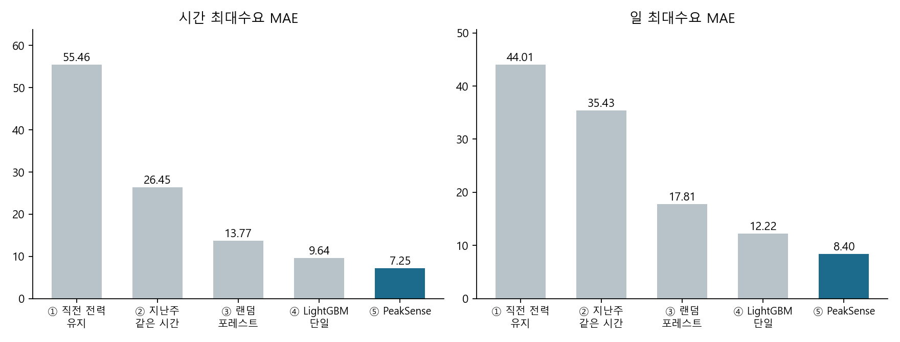
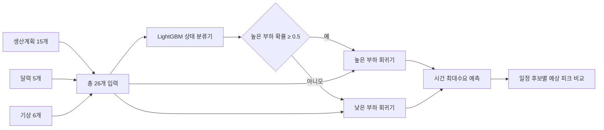

# PeakSense · KAMP 제조공장 전력 피크 예측

**생산계획으로 다음 날 전력 피크를 예측하고, 생산목표를 유지하는 일정 후보를 비교합니다.**

제6회 K-인공지능 제조데이터 분석 경진대회에서 진행한 **「제조 생산데이터 기반 전력사용량 예측 및 최대피크 위험조건 분석」** 프로젝트입니다. KAMP의 자원 최적화 AI 데이터셋을 사용해 데이터 진단, 예측모델 설계, 오류분석, 생산일정 활용까지 연결했습니다.

[프로젝트 진행 내용](docs/PROJECT_OVERVIEW.md) · [분석 결과와 운영 활용](docs/ANALYSIS_AND_APPLICATION.md) · [실험 결과](docs/RESULTS.md) · [실행 안내](docs/REPRODUCING.md) · [검증 범위와 개선 과제](docs/LIMITATIONS.md)

## 어떤 문제를 풀었나요?

공장은 생산량과 가동 시점에 따라 전력이 크게 달라집니다. 시간 평균만 예측하면 짧은 구간의 큰 피크를 놓칠 수 있고, 생산량이 0이라고 전력이 항상 낮은 것도 아닙니다.

PeakSense는 한 시간 안의 **네 15분 전력값 중 최댓값**을 예측합니다. 먼저 높은 부하와 낮은 부하 상태를 구분하고, 각 상태에 맞는 회귀모델로 전력을 추정합니다. 예측 입력을 생산계획 중심으로 구성해, 계획을 바꿨을 때 예상 피크가 어떻게 달라지는지도 비교할 수 있도록 했습니다.

## 핵심 결과

| 비교 항목 | 단일 LightGBM | PeakSense | 오차 감소 |
|---|---:|---:|---:|
| 시간 최대수요 MAE | 9.64 | **7.25** | **24.8%** |
| 하루 최대수요 MAE | 12.22 | **8.40** | **31.3%** |

두 모델은 동일한 26개 입력을 사용합니다. 평가 기간은 **2021.7.1–9.14**, 유효 평가 자료는 **1,759시간·74일**이며, 시간 순서를 유지해 11회 재학습했습니다. 11주 중 10주에서 PeakSense의 MAE가 더 작았습니다.



위 수치는 최종 코드에 포함된 **제출 당시 저장 결과**입니다. 저장된 예측값에서 주요 지표를 다시 계산해 일치를 확인했습니다. 이번 저장소 정리 과정에서 전체 학습을 새로 실행한 결과는 아닙니다. 전력 단위가 확정되지 않아 MAE는 원자료의 전력값 척도로 표기합니다. 실제 기상예보를 사용한 현장 성능이나 전력비 절감 실적을 뜻하지 않습니다.

## 데이터 이해와 전처리

- **대상:** 선박 엔진용 볼트·너트 제조공장의 전력·생산·기상 자료
- **범위:** 2021.1.1–9.14, 원본 6,168행·18개 항목
- **기록 단위:** 1행 = 1시간, 해당 시간의 15분 전력 4개 포함
- **유효 분석 자료:** 시간 오류 48행과 추가 결측 구간 17행을 제외한 **6,103시간**
- **시간축 보존:** 제외한 시간은 계산용 시간축에서 NaN으로 남겨 앞뒤 기록이 붙지 않도록 처리
- **누설 방지:** 같은 시간의 전력을 이용해 계산된 `공장인원`은 예측 입력에서 제외

원본·전처리 CSV, 학습 가중치, 발표자료·보고서 원본 파일은 포함하지 않습니다. 최종 30장 발표자료의 내용은 [프로젝트 진행 내용](docs/PROJECT_OVERVIEW.md)에 정리했습니다. [공식 데이터셋 안내](https://www.kamp-ai.kr/aidataDetail?DATASET_SEQ=27)에서 자료를 직접 받은 뒤 `data/okm_augumented_2021.csv`에 둡니다. [변수 설명과 처리 근거](docs/DATA.md)를 함께 확인해 주세요.

## 모델 설계



| 구분 | 내용 |
|---|---|
| 생산계획 15개 | 계획 생산량, 앞뒤 계획, 시작·종료, 연속 생산시간, 하루 총생산량 등 |
| 달력 5개 | 시간, 요일, 토·일요일 여부, 인건비 배율 |
| 기상 6개 | 기온·풍속·습도·강수량, 냉방·난방 관련 파생값 |
| 회귀 정답 | `peak = max(15분, 30분, 45분, 60분)` |
| 상태 학습 라벨 | `peak > 70`이면 1, 그 외 0 |
| 분석용 피크 기준 | `peak >= 187` — 상태 라벨 기준 70과 용도가 다름 |

상태 라벨은 실제 설비의 ON/OFF 센서값이 아니라 전력으로 정의한 부하 상태입니다. 미래 전력으로 미래 입력을 만드는 것이 아니라, 과거 자료의 정답을 학습한 분류기가 미래 상태를 예측합니다. 다음 날 모델의 최종 입력에는 과거 전력을 넣지 않고, 과거 전력은 입력 비교 실험과 당일 예측 갱신에서 별도로 사용합니다.

운영 시에는 **미리 확보한 생산계획과 기상예보**가 필요합니다. 현재 실험은 제공된 생산 기록을 계획으로 간주하고 관측 기상을 예보의 대용으로 사용했으므로, 실제 배포 전 입력의 가용 시점을 확인해야 합니다. [모델 상세](docs/MODEL.md)

## 실행하기

Python 3.10 이상에서 저장소 루트 기준으로 실행합니다.

```bash
git clone https://github.com/danielkim717/PeakSense.git
cd PeakSense
python -m venv .venv
# Windows: .venv\Scripts\activate
# macOS / Linux: source .venv/bin/activate
python -m pip install -r requirements.txt

# data/okm_augumented_2021.csv 배치 후
python 01_model_comparison.py
python 05_train_final.py
```

미래 구간 예측 예시:

```bash
python 06_predict.py --start "2021-09-15 00:00" --end "2021-09-15 23:45" --plan plan_template.csv
```

`plan_template.csv`는 형식 확인용 예시 계획입니다. 실제 사용 시 생산계획과 기상예보로 교체해야 합니다. GRU는 별도로 PyTorch 설치가 필요합니다. 한글 그래프의 기본 글꼴은 Windows의 맑은 고딕입니다. [단계별 실행과 재현 조건](docs/REPRODUCING.md)

## 저장소 구성

```text
PeakSense/
├── 01_model_comparison.py      # 기준 모델·입력·구조·15분 예측 비교
├── 02_robustness.py            # 주별 성능·민감도·예측구간 분석
├── 03_gru_optional.py          # 선택: GRU와 공통 시간 비교
├── 04_peak_factors.py          # 피크 조건·SHAP·오류 분석
├── 05_train_final.py           # 전체 유효 자료로 모델 학습·저장
├── 06_predict.py               # 지정 시간구간 예측
├── 07_schedule_optimizer.py    # 생산일정 후보 탐색 실험
├── 08_model_extensions.py      # 개선모델·예측구간 확장 실험
├── 09_tomorrow_preview.py      # 다음 날 피크 미리보기
├── src/                       # 전처리·특성·모델·평가·일정 코드
├── data/README.md             # 데이터 준비 안내
├── results/competition/       # 제출 당시 집계 결과 JSON
├── docs/                      # 프로젝트 설명·분석·모델·검증 문서와 그래프
└── plan_template.csv          # 미래 계획 입력 양식
```

## 분석에서 운영 활용까지

예측값만 만드는 데서 그치지 않고 다음 내용을 수행했습니다.

1. **피크 조건 분석:** 시간대·요일·생산량·기온별 발생률을 비교하고, 오전 생산과 고온이 겹치는 조건을 확인했습니다.
2. **모델 해석과 오류분석:** SHAP으로 모델의 예측 요인을 살펴보고, 오후 고온 구간의 과소예측을 후속 개선 대상으로 삼았습니다.
3. **운영 방안:** 전날 위험시간 확인 → 작업 순서·시점 검토 → 당일 15분 관측으로 갱신 → 생산목표와 피크를 함께 확인하는 절차를 제안했습니다.
4. **확장 실험:** 기온×시간 특성·피크 가중 학습, 적응형 예측구간, 생산목표를 유지하는 일정 후보 탐색, 다음 날 피크 미리보기를 구현했습니다.

자세한 내용은 [분석 결과와 운영 활용](docs/ANALYSIS_AND_APPLICATION.md)에 정리했습니다. 일정 변경 효과는 사후 분석 또는 모델 추정이며, 실제 설비에 적용한 성과와 구별합니다. 최종 발표자료에 추가된 통합 예측 엔진의 일부 지표는 제공 코드 묶음에 대응 구현이 없어 [확인 범위](docs/PROJECT_OVERVIEW.md#자료와-코드의-버전-범위)를 별도로 표시했습니다.

## 의의와 후속 과제

PeakSense의 핵심은 **서로 다른 전력 상태를 나누어 학습하고, 생산계획 변경을 검토할 수 있는 입력 구조를 만든 것**입니다. 동일 입력의 단일 모델보다 오차를 줄였고, 당일에는 최근 오차를 반영하는 방식으로 15분 앞 예측도 개선했습니다.

일정 탐색은 현장 활용을 위한 실험 단계입니다. 실제 설비 용량·작업 순서·납기와 예보 오차를 반영한 검증이 남아 있습니다. 또한 예측구간의 잔차 시간 경계와 일정 탐색 목적함수에서 재검증할 사항을 확인했습니다. 따라서 경보 성능과 일정 저감률을 검증 완료 성과로 제시하지 않습니다. [확인된 한계와 개선 우선순위](docs/LIMITATIONS.md)를 참고해 주세요.

## 팀과 출처

- **광운대학교 전자통신공학과:** 강기택 · 김태우 · 신여진
- **공모전:** [제6회 K-인공지능 제조데이터 분석 경진대회](https://www.kamp-ai.kr/contestNoticeDetail?CPT_NOTICE_SEQ=28)
- **데이터 출처:** 중소벤처기업부, Korea AI Manufacturing Platform(KAMP), 자원 최적화 AI 데이터셋, KAIST(울산과학기술원, ㈜유피시앤에스), 2021.12.27., www.kamp-ai.kr

저장소 공개는 원본 데이터의 재배포 허가를 의미하지 않습니다. 코드·문서에도 별도 오픈소스 라이선스는 아직 지정하지 않았습니다. [출처와 이용 범위](docs/ATTRIBUTION.md)
