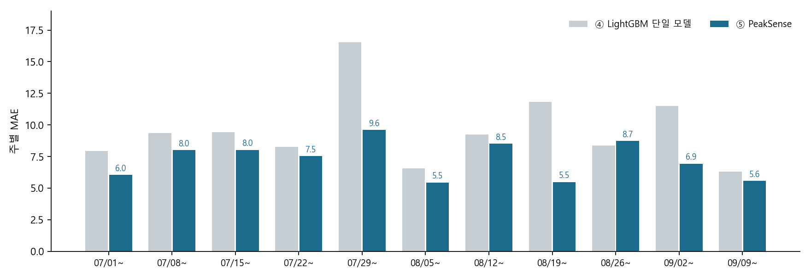
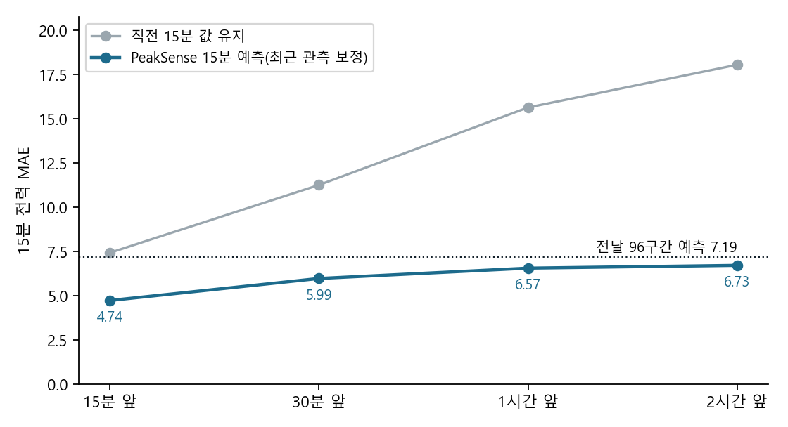

# 실험 결과

아래는 `results/competition/`에 보존한 제출 당시 집계값입니다. 수치는 반올림했으며 전체 학습을 이번에 다시 수행한 결과가 아닙니다. 결과 해석의 조건은 [LIMITATIONS.md](LIMITATIONS.md)를 따릅니다.

## 주 평가: 1,759시간·74일

| 모델 | 시간 최대수요 MAE | 하루 최대수요 MAE |
|---|---:|---:|
| 직전 관측 전력 유지 | 55.46 | 44.01 |
| 지난주 같은 시간 | 26.45 | 35.43 |
| 랜덤포레스트(가이드북 입력) | 13.77 | 17.81 |
| 단일 LightGBM(최종 26개 입력) | 9.64 | 12.22 |
| PeakSense(최종 26개 입력) | **7.25** | **8.40** |

직전 관측 유지 기준은 예측 시점에 관측 가능한 마지막 값을 사용하는 전일 예측 기준입니다. 바로 앞 시간의 실측을 매시간 제공하는 조건과 다릅니다. 공정한 구조 비교의 핵심은 **같은 26개 입력을 사용한 단일 LightGBM과 PeakSense**입니다. 두 모델의 저장 예측값으로 MAE와 일 최대 MAE를 다시 계산해 결과 JSON과 일치함을 확인했습니다.

## 입력·구조 비교

| 실험 | MAE |
|---|---:|
| 생산계획+달력+기상 | **7.25** |
| 위 입력+전날 오전 전력 | 7.28 |
| 위 입력+과거 전력 후보 전부 | 11.28 |
| 생산계획 제외 | 16.44 |
| 기상 제외 | 14.20 |
| 두 회귀기 확률 가중 결합 | 7.54 |
| 생산량 > 0을 상태 정답으로 사용 | 10.29 |

이 결과는 이 데이터와 평가 조건에서 생산계획·기상·상태 구분이 유용했음을 보여줍니다. 모든 공장에서 과거 전력이 불필요하다거나 기상이 인과적으로 전력을 변화시킨다는 결론은 아닙니다.

## GRU 비교: 공통 1,728시간

| 모델 | MAE |
|---|---:|
| 랜덤포레스트 | 13.89 |
| GRU | 10.05 |
| 단일 LightGBM | 9.68 |
| PeakSense | **7.24** |

주 평가의 7.25와 표본이 다릅니다. 출처: [`ch2_gru.json`](../results/competition/ch2_gru.json).

## 당일 15분 예측 갱신: 8.1–9.14

| 예측할 미래 시점 | 직전 15분 값 유지 MAE | 당일 갱신 MAE |
|---|---:|---:|
| 15분 앞 | 7.44 | **4.74** |
| 30분 앞 | 11.27 | **5.99** |
| 1시간 앞 | 15.64 | **6.57** |
| 2시간 앞 | 18.06 | **6.73** |

## 남은 오류와 활용 범위

고전력 구간(187 이상)의 PeakSense MAE는 **13.46**으로 전체 MAE보다 큽니다. 피크가 큰 날의 과소예측을 줄이는 것이 후속 과제입니다. 생산일정 실험은 예측모델 안에서 후보 계획을 비교한 결과이며 실제 공장에서 전력·비용을 절감한 실적이 아닙니다.

제출 당시 경보 재현율, 예측구간 적중률, 일정 저감률도 원본 집계 파일과 보고서에 남아 있습니다. 그러나 잔차의 시간 경계와 일정 목적함수의 검증 과제가 있어 README의 확정 성과 표에서는 제외했습니다. 검증 이슈가 있는 확장 지표를 시간 최대수요 점 예측 MAE와 혼동하지 않아야 합니다.
